### PlantTree.eth
这是一个基于区块链的互联网植树应用，可以实现植树发起人和种树人之间的交互，植树发起人可以向种树人发起植树请求订单，而种树人可以依照订单将树的所有权转移到植树发起者的名下。完成交易。
#### 项目安装
先从github上克隆整个项目，使用npm install安装依赖包。  
安装truffle之后进入项目运行truffle develop启动truffle，然后使用命令migrate将智能合约部署到链上。  
在chrome浏览器上安装插件metamask，将网络切换到私有链上，然后从truffle生成的10个账户中选几个import到metamask上。完成效果如下：  
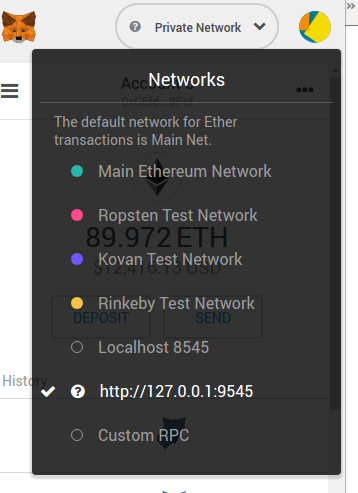  
私有链的地址在启动truffle已经给出，可以自行查看。   
然后打开另一个命令行，输入npm run dev启动应用。应用默认的网址为http://127.0.0.1:8080。   
#### 项目测试
##### 开始界面：
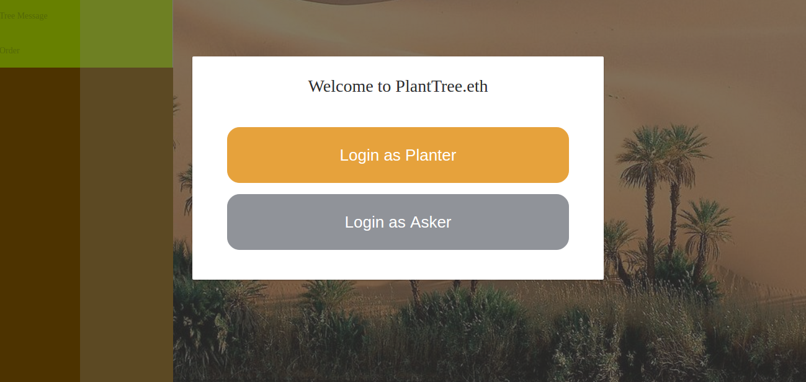
登录的时候会根据metamask中的账户登录，需要扣除一定的以太币，但是这无须担心，因为truffle默认为每个账户存储了100以太币。
##### 注册并登录后：

##### 以种树人的身份登录：
种树人可以编辑树的信息便于之后的交易。点击编辑按钮就可以开始编辑
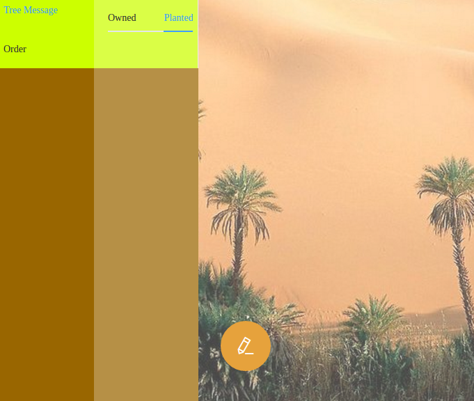
##### 编辑树的信息：
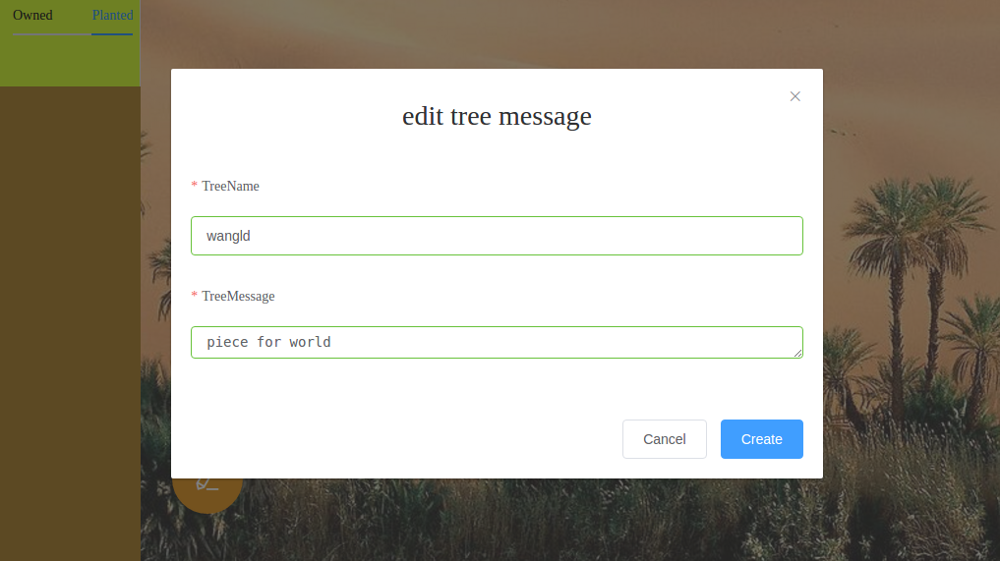
##### 为树创建信息：
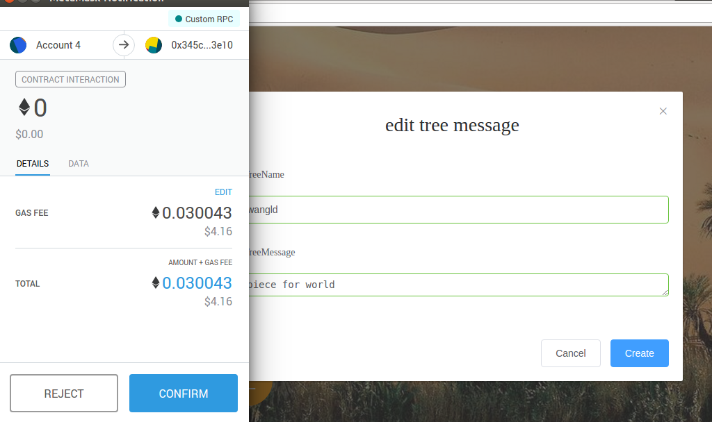
创建过程会消耗一定gas fee。点击confirm就可以创建树的信息了。
##### 查看创建的树的信息：
由于在合约编写的时候忘记返回树的信息了，只返回了树的名字，所以查看时只有树的名字。
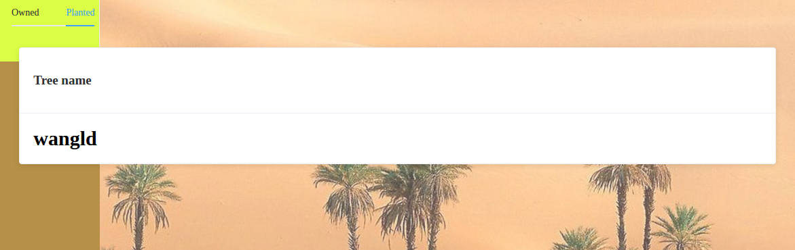
##### 作为种树发起人注册并登录：
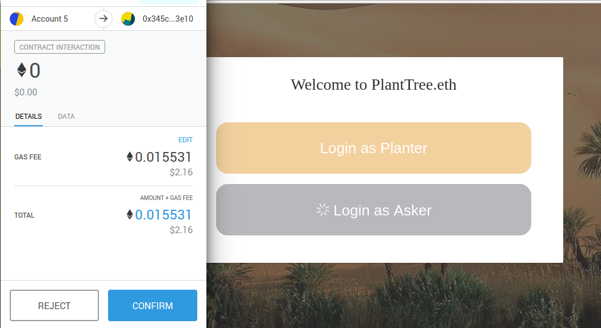
需要一定的gas fee。
##### 创建交易
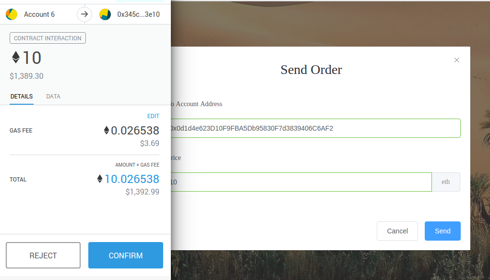
##### 种树人查收交易并完成交易：
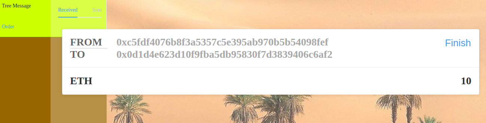
点击finish选择一棵树完成交易：
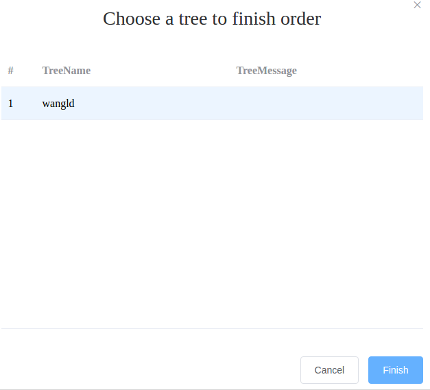
##### 可以查看到交易完成：
通过metamask可以看到种树人的金额增加了10以太币，而种树发起人的账户中减少了10以太币。
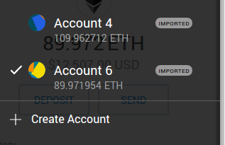
##### 查看种树发起人名下的树：
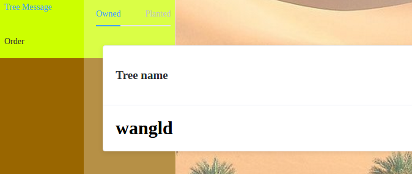
可以看到种树请求者名下已经有这棵树了，说明交易成功。
