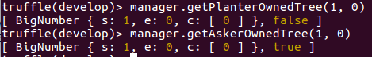

### 基于区块链的互联网植树应用
#### 基本功能包括
1. 种树请求者发送请求植树交易
2. 植树者植树
3. 植树者将自己种下的树转移到种树请求者名下，实现种树请求者的交易。这个过程需要种树请求者的金额交易

#### 实现的结构体
1. 定义一个结构体存放种树人名下和种树请求者名下的树的序号和是否在其名下
    ```
    struct OwnedIndex {
        uint index;
        bool active;//false->belong to planter, true->belong to asker
    }
    ```
2. 树木：包括树木的名字和基本信息，包括这棵树的种树人是谁，拥有者是谁。
    ```
    struct message{
        string treeName;
        bytes32 treeFullMessage;
    }

    struct tree{
        address planter;
        address owner;
        message treeContent;
    }
    ```
3. 交易的结构体，包括种树请求者地址，植树人地址，交易状态，交易金额
    ```
    enum state {finished, unfinished}

    struct order {
        address planter;
        address asker;
        uint price;
        state st;
    }
    ```
#### 基本的函数实现
1. 创建账户
    ```
    function createPlanter() public {
        require(planterIndex[msg.sender] == 0);
        planters[planterCounter] = Planter(Account(msg.sender, 0, 0), planterCounter, 0);
        planterIndex[msg.sender] = planterCounter;
        planterCounter ++;
    }

    function createAsker() public {
        require(askerIndex[msg.sender] == 0);
        askers[askerCounter] = Asker(Account(msg.sender, 0, 0), askerCounter, 0);
        askerIndex[msg.sender] = askerCounter;
        askerCounter ++;
    }
    ```
2. 植树
    ```
    function _plantTree(string treeName, bytes32 treeFullMess) public {
        uint planterIndex = getPlanterIndex(msg.sender);
        uint treeIndex = plantTree(msg.sender, treeName, treeFullMess);
        planters[planterIndex].plantedTree[planters[planterIndex].treeCounter] = treeIndex;
        _addPlanterOwnedTree(planterIndex, treeIndex);
        planters[planterIndex].treeCounter++;
    }
    ```
    这里需要获取植树人的序号，获取树的序号，在未完成交易之前，这棵树还处在植树人的名下，然后植树人种下的树的数量增加1。
3. 种树请求者创建交易
    ```
    function _createOrder(address planter) public payable {
        uint planterId = getPlanterIndex(planter);
        uint askerId = getAskerIndex(msg.sender);
        uint orderId = createOrder(planter, msg.value);
        planters[planterId].account.orders[planters[planterId].account.orderCounter++] = orderId;
        askers[askerId].sendOrder[askers[askerId].orderCounter++] = orderId;
    }
    ```
    标记当前种树请求者的交易号，同时无论是种树请求者还是植树人的交易数量都增加。
4. 完成交易，这里包括将植树人名下指定的树转移到种树请求者的名下，同时将该树从植树人的名下移除。因此要先获取种树人的Id和种树请求者的Id。
    ```
    function _finishOrder(uint treeIndex, uint orderIndex) public {
        uint temp_treeIndex;
        bool ownerJudge;

        order storage myorder = getOrder(orderIndex);
        uint planterId = getPlanterIndex(msg.sender);
        uint askerId = getAskerIndex(myorder.asker);

        (temp_treeIndex, ownerJudge) = getPlanterOwnedTree(planterId, treeIndex);
        require(ownerJudge);
        changeOwner(temp_treeIndex, myorder.asker);
        finishOrder(orderIndex);
        _addAskerOwnedTree(askerId, temp_treeIndex);
        _removePlanterOwnedTreeAt(planterId, treeIndex);
        
    }
    ```
    这里涉及到先判断这棵树是否在种树人的名下，然后执行转移操作，完成交易并转移交易费用。
#### 部署结果
部署环境为truffle。  
在开始测试之前先为合约创建一个实例引用
```
Manager.deployed().then(instance=>manager=instance)
```  
1. 创建用户
    ```
    acc1 = web3.eth.accounts[1]
    manager.createPlanter({from: acc1})
    acc2 = web3.eth.accounts[2]
    manager.createAsker({from: acc2})
    ```
    结果为
    
    
2. 种下一棵树，这棵树一开始归于植树人名下
    ```
    var treeName = "peace"
    var treeMess = "At 2018/11/26"
    manager._plantTree(treeName, treeMess,
    {from: acc1})
    ```
    结果为
    
3. 种树请求者发起交易。  
    在发起交易之前，我们先看一下两个账户的余额
      
    然后发起交易，当然是从种树请求者向种树人发起的交易
    ```
    var price = web3.toWei(10, "ether")
    manager._createOrder(acc1, {from: acc2, value: price})
    ```
    结果为
    
4. 然后我们可以从种树人处获取交易并查看交易双方的地址和交易金额
    
    可以看出交易金额为10个以太币。
5. 完成交易并查看双方账户金额
    ```
    manager._finishOrder(0, transIndex, {from: acc1})
    ```
    结果为：
    
    查看双方账户余额，并查看双方名下的树木
    
    可以看出交易已经成功，种树人的余额多了10以太币，而种树请求者的余额少了10以太币  
    
    可以看出种树人名下的树已经转移到种树请求者名下。
#### 测试完成


